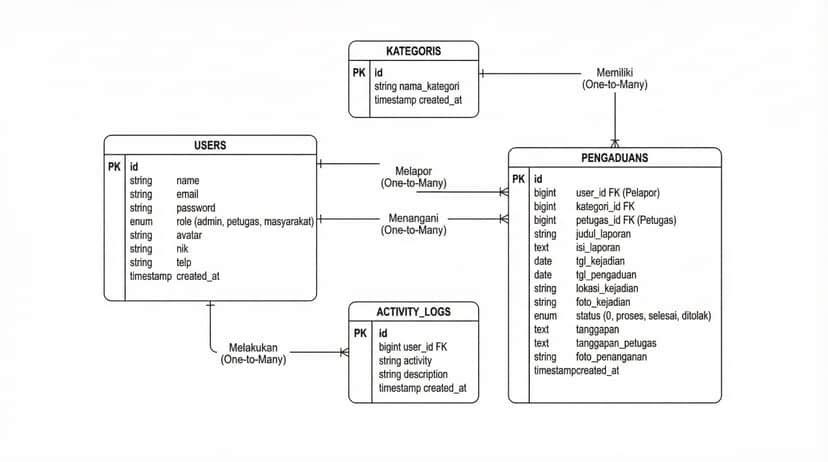
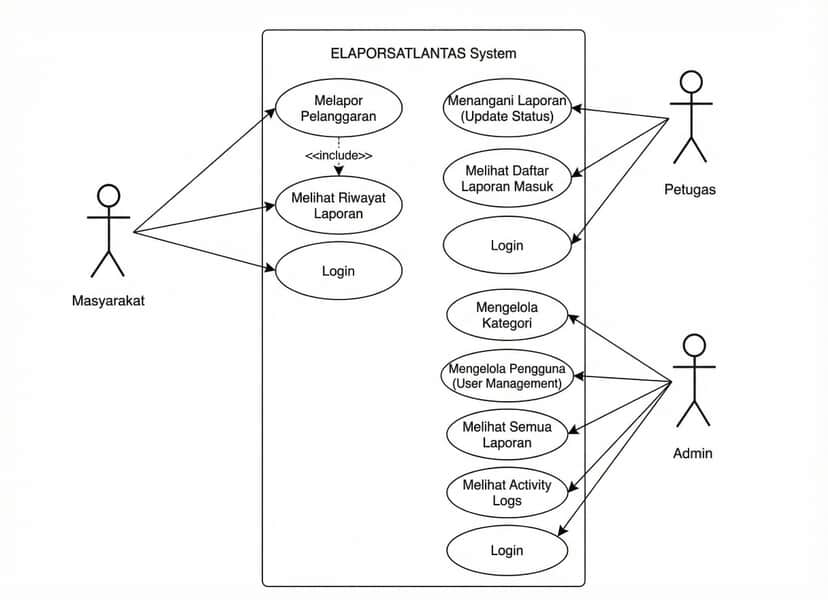

# Dokumentasi Proyek eLaporSatlantas

## Konsep Dari Web Yang Saya Buat

**eLaporSatlantas** adalah website sistem pengaduan dan laporan lalu lintas yang dirancang untuk memudahkan masyarakat melaporkan kejadian (kecelakaan, kemacetan, pelanggaran, infrastruktur) ke Satlantas secara online. eLaporSatlantas bertujuan untuk memberikan pengalaman pelaporan yang lebih cepat, efisien, dan transparan, sehingga seluruh proses penerimaan dan penanganan laporan dapat berjalan dengan lancar tanpa harus datang langsung ke kantor Satlantas.

## Fitur Yang Tersedia

### Halaman Awal
- Home
- About
- Frequently Asked Questions (FAQ)
- Contact

### Authentication
- Register
- Login
- Logout

### Multi User

#### Admin
- Mengelola laporan masuk
- Melihat semua data laporan
- Mengedit data laporan (foto, kategori, lokasi, dll)
- Menghapus laporan
- Mengelola user (petugas)
- Mencetak laporan dalam format PDF
- Update status laporan

#### Petugas
- Melihat laporan yang ditugaskan
- Memperbarui status laporan
- Memberikan tanggapan/update progress

#### Masyarakat (User)
- Mengakses halaman awal tanpa login
- Mengakses halaman awal setelah login
- Login sebagai masyarakat
- Mengisi formulir laporan dengan bukti foto
- Mengedit laporan (sebelum diproses)
- Menghapus laporan (sebelum diproses)
- Melihat riwayat laporan dengan status terkini
- Download/print laporan

### All
- Login
- Logout
- Manajemen profil

## Akun Default

### Admin:
- Email: `admin@polres.id`
- Password: `password`

### Petugas:
- Email: `petugas@polres.id`
- Password: `password`

### Masyarakat:
- Email: `warga@gmail.com`
- Password: `password`

## ERD


## UML


## Teknologi yang Digunakan
- Laravel 10 (Web Framework)
- MySQL (Database)
- Tailwind CSS (Styling)
- Vite (Frontend Build Tool)
- DomPDF (PDF Generation)

## Tools yang Digunakan
- XAMPP / Laragon (Local Development)
- VSCode (Code Editor)
- Composer (PHP Package Manager)
- npm (Node Package Manager)
- Git (Version Control)

## Persyaratan untuk Instalasi

Pastikan terlebih dulu Anda memenuhi persyaratan berikut:

- PHP 8.0+
- Web Server (Apache)
- Database (MySQL atau MariaDB)
- Web Browser
- Git
- Composer
- Node.js dan npm

## Cara Instalasi eLaporSatlantas

### 1. Persyaratan
Pastikan terlebih dulu Anda memenuhi persyaratan berikut:

- PHP versi 8.0+
- Web Server (Apache)
- Database (MySQL atau MariaDB)
- Web Browser
- Git

### 2. Clone Repository
Pertama, clone repository dari GitHub dengan perintah berikut:

```bash
git clone https://github.com/arisramzi/elaporsatlantas.git
```

### 3. Masuk ke Direktori Proyek
Setelah clone selesai, masuk ke direktori proyek:

```bash
cd elaporsatlantas
```

### 4. Instalasi Dependensi PHP
Instal dependensi menggunakan Composer:

```bash
composer install
```

### 5. Instalasi Dependensi Frontend
Instal dependensi Node.js:

```bash
npm install
```

### 6. Salin File .env
Salin file `.env.example` menjadi `.env`:

```bash
cp .env.example .env
```

### 7. Atur Kunci Aplikasi
Generate kunci aplikasi menggunakan Artisan:

```bash
php artisan key:generate
```

### 8. Konfigurasi Database
Edit file `.env` dan atur konfigurasi database sesuai pengaturan lokal Anda:

```env
DB_CONNECTION=mysql
DB_HOST=127.0.0.1
DB_PORT=3306
DB_DATABASE=elaporsatlantas
DB_USERNAME=root
DB_PASSWORD=
```

### 9. Jalankan Migrations
Jalankan perintah berikut untuk membuat tabel di database:

```bash
php artisan migrate
```

### 10. Jalankan Server
Jalankan server lokal dengan perintah berikut:

```bash
npm run dev
php artisan serve
```